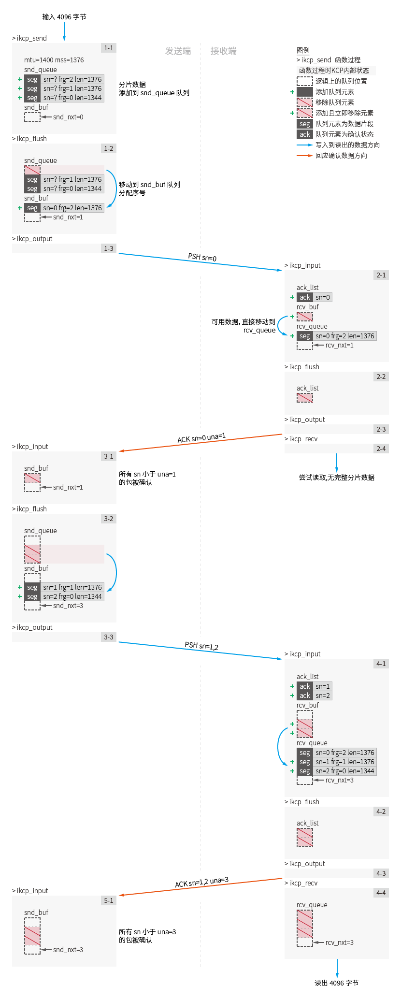
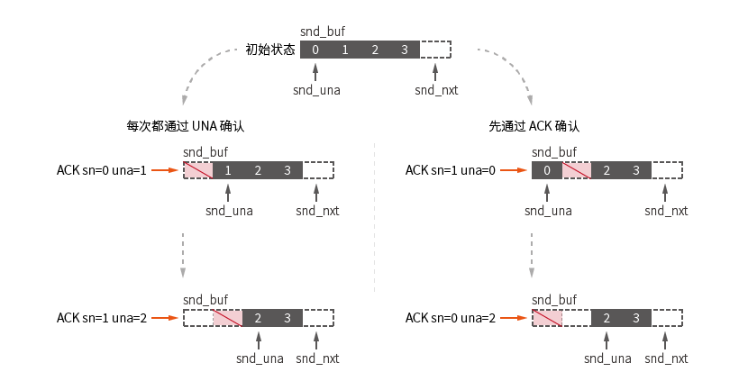
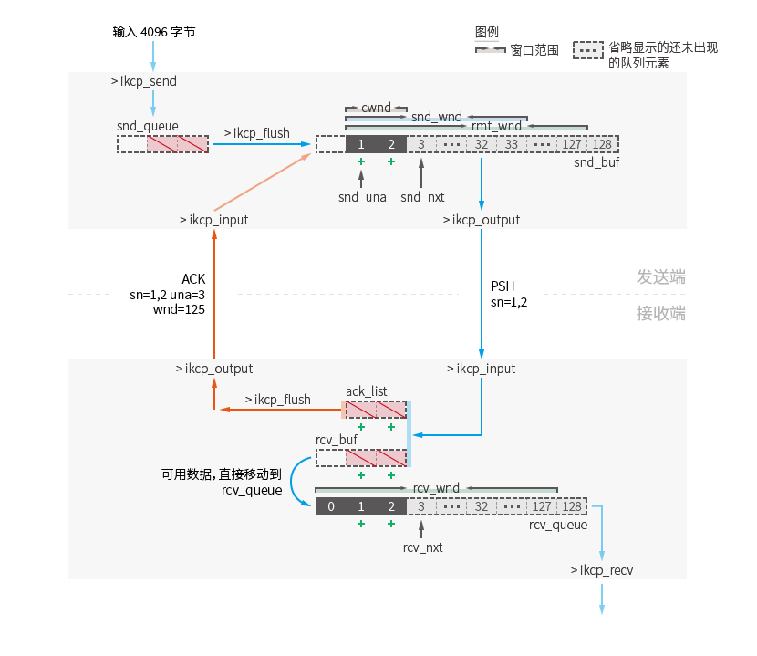
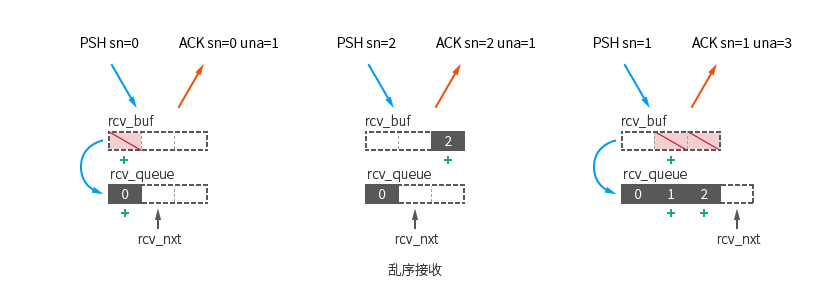
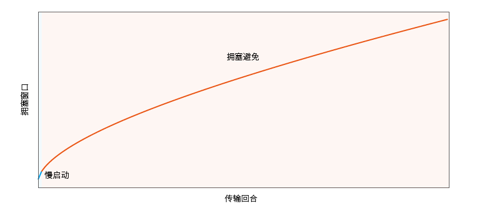
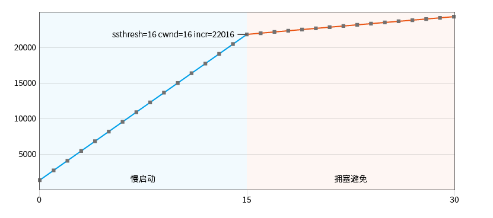
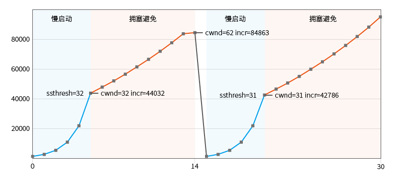
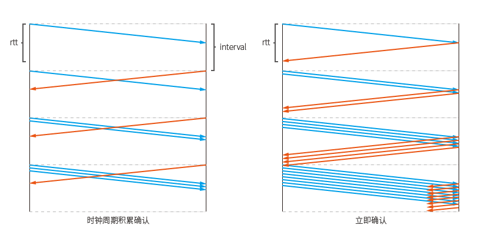
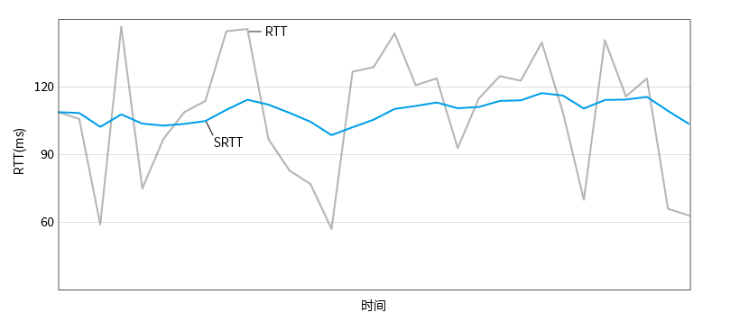

# Learning KCP Protocol

在特定的应用场合，单纯的使用 TCP 不能满足需要。直接使用 UDP 数据报不能保证数据的可靠性，常需要在应用层基于 UDP 实现一套可靠的传输协议。

直接使用 KCP 协议是一种选择，它实现了健全的自动重传协议，并在此之上提供了自由的参数调整。通过配置参数和合适的调用方式来适应不同场景的需求。

KCP 简介:
> KCP是一个快速可靠协议，能以比 TCP 浪费 10%-20% 的带宽的代价，换取平均延迟降低 30%-40%，且最大延迟降低三倍的传输效果。纯算法实现，并不负责底层协议（如UDP）的收发，需要使用者自己定义下层数据包的发送方式，以 callback的方式提供给 KCP。 连时钟都需要外部传递进来，内部不会有任何一次系统调用。
> 整个协议只有 ikcp.h, ikcp.c两个源文件，可以方便的集成到用户自己的协议栈中。也许你实现了一个P2P，或者某个基于 UDP的协议，而缺乏一套完善的ARQ可靠协议实现，那么简单的拷贝这两个文件到现有项目中，稍微编写两行代码，即可使用。

文章最前会列出数据和结构的基本参考，后者会对算法进行流程描述和代码实现分析。

参考的源代码为撰写文章时的[版本](https://github.com/skywind3000/kcp/tree/f553df7afc46fbad599bb6d92484baa02dc83f86)。本文不会完全贴上所有KCP的源代码，会在关键处添加指向源代码相应位置的链接。

## 基本结构参考

### IKCPSEG 结构

[IKCPSEG](https://github.com/skywind3000/kcp/blob/f553df7afc46fbad599bb6d92484baa02dc83f86/ikcp.h#L267) 结构用于存储发送和接收的数据段状态。

IKCPSEG 所有字段描述:

    struct IKCPSEG
    {
        /* 队列节点，IKCPSEG 作为一个队列元素，此结构指向了队列后前后元素 */
        struct IQUEUEHEAD node;
        /* 会话编号 */
        IUINT32 conv;
        /* 指令类型 */
        IUINT32 cmd;
        /* 分片号 (fragment) 
           发送数据大于 MSS 时将被分片，0为最后一个分片.
           意味着数据可以被recv，如果是流模式，所有分片号都为0
        */
        IUINT32 frg;
        /* 窗口大小 */
        IUINT32 wnd;
        /* 时间戳 */
        IUINT32 ts;
        /* 序号 (sequence number) */
        IUINT32 sn;
        /* 未确认的序号 (unacknowledged) */
        IUINT32 una;
        /* 数据长度 */
        IUINT32 len;
        /* 重传时间 (resend timestamp) */
        IUINT32 resendts;
        /* 重传的超时时间 (retransmission timeout) */
        IUINT32 rto;
        /* 快速确认计数 (fast acknowledge) */
        IUINT32 fastack;
        /* 发送次数 (transmit) */
        IUINT32 xmit;
        /* 数据内容 */
        char data[1];
    };

结构末尾的 `data` 字段用于索引结构体尾部的数据，额外分配的内存扩展了运行时的 data 字段数组的实际长度 ([ikcp.c:173](https://github.com/skywind3000/kcp/blob/f553df7afc46fbad599bb6d92484baa02dc83f86/ikcp.c#L173))。

### 传输协议头部

IKCPSEG 结构仅为内存状态，仅有部分字段会编码到传输协议中。

[ikcp_encode_seg](https://github.com/skywind3000/kcp/blob/f553df7afc46fbad599bb6d92484baa02dc83f86/ikcp.c#L906) 函数对传输协议头部编码:

    /* 协议头一共 24 字节 */
    static char *ikcp_encode_seg(char *ptr, const IKCPSEG *seg)
    {
        /* 会话编号 (4 Bytes) */
        ptr = ikcp_encode32u(ptr, seg->conv);
        /* 指令类型 (1 Bytes) */
        ptr = ikcp_encode8u(ptr, (IUINT8)seg->cmd);
        /* 分片号 (1 Bytes) */
        ptr = ikcp_encode8u(ptr, (IUINT8)seg->frg);
        /* 窗口大小 (2 Bytes) */
        ptr = ikcp_encode16u(ptr, (IUINT16)seg->wnd);
        /* 时间戳 (4 Bytes) */
        ptr = ikcp_encode32u(ptr, seg->ts);
        /* 序号 (4 Bytes) */
        ptr = ikcp_encode32u(ptr, seg->sn);
        /* 未确认的序号 (4 Bytes) */
        ptr = ikcp_encode32u(ptr, seg->una);
        /* 数据长度 (4 Bytes) */
        ptr = ikcp_encode32u(ptr, seg->len);
        return ptr;
    }

### IKCPCB 结构

[IKCPCB](https://github.com/skywind3000/kcp/blob/f553df7afc46fbad599bb6d92484baa02dc83f86/ikcp.h#L289) 结构存储了 KCP 协议的所有上下文，通过创建对端的两个 IKCPCB 对象进行协议通讯。

    struct IKCPCB
    {
        /*  conv: 会话编号 
            mtu: 最大传输单元
            mss: 最大报文长度
            state: 此会话是否有效 (0: 有效 ~0:无效)
        */
        IUINT32 conv, mtu, mss, state;
        /*  snd_una: 发送的未确认数据段序号
            snd_nxt: 发送的下一个数据段序号
            rcv_nxt: 期望接收到的下一个数据段的序号
        */
        IUINT32 snd_una, snd_nxt, rcv_nxt;
        /*  ts_recent: (弃用字段?)
            ts_lastack: (弃用字段?)
            ssthresh: 慢启动阈值 (slow start threshold)
        */
        IUINT32 ts_recent, ts_lastack, ssthresh;
        /*  rx_rttval: 平滑网络抖动时间 
            rx_srtt: 平滑往返时间
            rx_rto: 重传超时时间 
            rx_minrto: 最小重传超时时间
        */
        IINT32 rx_rttval, rx_srtt, rx_rto, rx_minrto;
        /*  snd_wnd: 发送窗口大小
            rcv_wnd: 接收窗口大小
            rmt_wnd: 远端窗口大小
            cwnd: 拥塞窗口 (congestion window)
            probe: 窗口探测标记位，在 flush 时发送特殊的探测包 (window probe)
        */
        IUINT32 snd_wnd, rcv_wnd, rmt_wnd, cwnd, probe;
        /*  current: 当前时间 (ms)
            interval: 内部时钟更新周期
            ts_flush: 期望的下一次 update/flush 时间
            xmit: 全局重传次数计数
        */
        IUINT32 current, interval, ts_flush, xmit;
        /*  nrcv_buf: rcv_buf 接收缓冲区长度
            nsnd_buf: snd_buf 发送缓冲区长度
            nrcv_que: rcv_queue 接收队列长度
            nsnd_que: snd_queue 发送队列长度
        */
        IUINT32 nrcv_buf, nsnd_buf;
        IUINT32 nrcv_que, nsnd_que;
        /*  nodelay: nodelay模式 (0:关闭 1:开启)
            updated: 是否调用过 update 函数
        */
        IUINT32 nodelay, updated;
        /*  ts_probe: 窗口探测标记位
            probe_wait: 零窗口探测等待时间，默认 7000 (7秒)
        */
        IUINT32 ts_probe, probe_wait;
        /*  dead_link: 死链接条件，默认为 20。
            (单个数据段重传次数到达此值时 kcp->state 会被设置为 UINT_MAX)
            incr: 拥塞窗口算法的一部分
        */
        IUINT32 dead_link, incr;
        /* 发送队列 */
        struct IQUEUEHEAD snd_queue;
        /* 接收队列 */
        struct IQUEUEHEAD rcv_queue;
        /* 发送缓冲区 */
        struct IQUEUEHEAD snd_buf;
        /* 接收缓冲区 */
        struct IQUEUEHEAD rcv_buf;
        /* 确认列表, 包含了序号和时间戳对(pair)的数组元素*/
        IUINT32 *acklist;
        /* 确认列表元素数量 */
        IUINT32 ackcount;
        /* 确认列表实际分配长度 */
        IUINT32 ackblock;
        /* 用户数据指针，传入到回调函数中 */
        void *user;
        /* 临时缓冲区 */
        char *buffer;
        /* 是否启用快速重传，0:不开启，1:开启 */
        int fastresend;
        /* 快速重传最大次数限制，默认为 5*/
        int fastlimit;
        /*  nocwnd: 控流模式，0关闭，1不关闭
            stream: 流模式, 0包模式 1流模式
        */
        int nocwnd, stream;
        /* 日志标记 */
        int logmask;
        /* 发送回调 */
        int (*output)(const char *buf, int len, struct IKCPCB *kcp, void *user);
        /* 日志回调 */
        void (*writelog)(const char *log, struct IKCPCB *kcp, void *user);
    };

    typedef struct IKCPCB ikcpcb;

### IQUEUEHEAD 队列结构

在 KCP 中仅有 2 种队列结构:

* 一种用于 acklist , 它以简单的指数增长的方式重新分配数组大小。
* 另一种用于发送与接受队列和缓冲区 (snd_queue/rcv_queue/snd_buf/rcv_buf) 的队列 IQUEUEHEAD 结构。

[IQUEUEHEAD](https://github.com/skywind3000/kcp/blob/f553df7afc46fbad599bb6d92484baa02dc83f86/ikcp.h#L137) 是一个简单的双向链表，其指向了队列起始(prev)和末尾(next)元素:

    struct IQUEUEHEAD {
        /*
        next:
            作为队列时: 队列的首元素 (head) 
            作为元素时: 当前元素所在队列的下一个节点
        prev:
            作为队列时: 队列的末元素 (last)
            作为元素时: 当前元素所在队列的前一个节点
        */
        struct IQUEUEHEAD *next, *prev;
    };

    typedef struct IQUEUEHEAD iqueue_head;

队列为空时 next/prev 会指向队列自身，而不是 NULL。

作为队列元素的 IKCPSEG 结构头部也复用了 IQUEUEHEAD 结构:

    struct IKCPSEG
    {
        struct IQUEUEHEAD node;
        /* ... */
    }

作为队列元素时记录了当前元素所在队列中的前一个(prev)元素和后一个元素(next)。

prev 指向队列时意味着当前元素所在队列首，next 指向队列时意味着当前元素所在队列尾。

所有的 [队列操作](https://github.com/skywind3000/kcp/blob/f553df7afc46fbad599bb6d92484baa02dc83f86/ikcp.h#L63) 以宏的方式提供。

## 配置选项参考

KCP 提供配置的方法有:

**工作模式选项**:

    int ikcp_nodelay(ikcpcb *kcp, int nodelay, int interval, int resend, int nc)

- nodelay :是否启用 nodelay模式，0不启用；1启用。
   - interval :协议内部工作的 interval，单位毫秒，比如 10ms或者 20ms
   - resend :快速重传模式，默认0关闭，可以设置2（2次ACK跨越将会直接重传）
   - nc :是否关闭流控，默认是0代表不关闭，1代表关闭。
   - 普通模式: ikcp_nodelay(kcp, 0, 40, 0, 0);
   - 极速模式: ikcp_nodelay(kcp, 1, 10, 2, 1);

**最大窗口选项**:

    int ikcp_wndsize(ikcpcb *kcp, int sndwnd, int rcvwnd);

发送窗口大小 `sndwnd` 必须大于 0，接收窗口大小 `rcvwnd` 必须大于 128，单位为包，而非字节。

**最大传输单元**:

KCP 不负责探测 MTU，默认值为 1400 字节，可以使用 ikcp_setmtu 来设置该值。该值将会影响数据包归并及分片时候的最大传输单元。较小的 MTU 会影响路由转优先级。

## 基本数据发送与接收流程

本文提供了一份能够基础运行 KCP 的代码 [kcp_basic.c](https://github.com/frimin/learning-kcp-protocol/blob/main/src/kcp_basic.c)，不到 100 行的示例代码为对 KCP 进行纯算法调用，不包括任何网络调度。(**重要**: 跟随文章调试它试试看!)

可以通过它来初步了解 IKCPCB 结构中的基本结构字段:

* `kcp.snd_queue`: 发送队列 (`kcp.nsnd_que` 记录长度)
* `kcp.snd_buf`: 发送缓冲区 (`kcp.nsnd_buf` 记录长度)
* `kcp.rcv_queue`: 接收队列 (`kcp.nrcv_que` 记录长度)
* `kcp.rcv_buf`: 接收缓冲区 (`kcp.nrcv_buf` 记录长度)
* `kcp.mtu`: 最大传输单元
* `kcp.mss`: 最大报文长度

以及结构 IKCPSEG 中的:
* `seg.sn`: 序号
* `seg.frg`: 分片号

通过 [ikcp_create](https://github.com/skywind3000/kcp/blob/f553df7afc46fbad599bb6d92484baa02dc83f86/ikcp.c#L234) 函数来创建 KCP 上下文结构 IKCPCB。

IKCPCB 内部会通过外部调用 ikcp_send (用户输入到发送端) 和 ikcp_input 输入数据 (发送端输入到接收端) 来创建对应的 IKCPSEG 结构存储数据和状态。

另外会通过 ikcp_recv (用户从接收端取出) 和 ikcp_input 确认数据 (发送端收到接收端确认) 来移除 IKCPSEG 结构。

> 详细的数据流动方向见 **队列与窗口** 小节

IKCPSEG 的创建和销毁主要出现在上述四种情况，其它常见于内部队列之间的移动和其它优化。

> 在后面的文章中，所有出现的 IKCPCB 与 IKCPSEG 结构字段均会通过 `标记` 来突出显示。IKCPCB 结构的所有字段均会加上 `kcp.` 前缀，所有 IKCPSEG 结构字段均会加上 `seg.` 前缀。通常在源码中对应的变量名或者函数参数名称也为 `kcp` 或者 `seg`。

此代码简单地对名为 k1 的 KCP 对象写入指定长度的数据，并从 k2 对象读出数据。KCP 配置为默认模式。

基本流程可以通过伪代码简单描述为:

    /* 创建两个 KCP 对象 */
    k1 = ikcp_create()
    k2 = ikcp_create()

    /* 向发送端 k1 写入数据 */
    ikcp_send(k1, send_data)

    /* 刷出数据，执行 kcp->output 回调 */
    ikcp_flush(k1)

    /* output 回调接收到带协议包头的分片数据，执行发送 */
    k1->output(fragment_data)

    /* 接收端 k2 收到输入数据 */
    ikcp_input(k2, input_data)

    /* 接收端刷出数据，会发送确认包到 k1 */
    ikcp_flush(k2)

    /* 发送端 k1 收到确认数据 */
    recv_data = ikcp_recv(k1, ack_data)

    /* 尝试读出数据 */
    recv = ikcp_recv(k2)

    /* 验证接收数据和发送数据一致 */
    assert(recv_data == send_data)

在示例代码中，创建的 KCP 对象除了 `kcp.output` 绑定了 kcp_user_output 函数用于定义 KCP 对象的输出数据的行为。`kcp.writelog` 也绑定了 kcp_user_writelog 函数用于调试打印。

另外由于 `kcp.output` 回调不能递归地调用其它 ikcp_input (因为最终会递归到自身的 `kcp.output`)，所以所有输出的数据必须存储在一个中间位置，退出 `kcp.output` 函数后，再输入到 k2 中。这是示例代码中定义的 OUTPUT_CONTEXT 结构的作用。

尝试运行示例代码，会得到下列输出内容 (# 符号追加的内容为说明):

    # k1.output 被调用，输出 1400 字节
    k1 [RO] 1400 bytes 
    # k2 被调用 ikcp_input 输入数据
    k2 [RI] 1400 bytes 
    # psh 数据推送分支处理
    k2 input psh: sn=0 ts=0 
    # k2.output 被调用，输出确认包，数据长度24字节
    k2 [RO] 24 bytes 
    # k1 被调用 ikcp_input 输入数据
    k1 [RI] 24 bytes 
    # 序号 sn=0 被确认
    k1 input ack: sn=0 rtt=0 rto=100 
    k1 [RO] 1400 bytes
    k1 [RO] 1368 bytes
    k2 [RI] 1400 bytes
    k2 input psh: sn=1 ts=0
    k2 [RI] 1368 bytes
    k2 input psh: sn=2 ts=0
    k2 [RO] 48 bytes
    k1 [RI] 48 bytes
    k1 input ack: sn=1 rtt=0 rto=100
    k1 input ack: sn=2 rtt=0 rto=100
    # k2 被调用 kcp_recv 取出数据
    k2 recv sn=0 
    k2 recv sn=1
    k2 recv sn=2

输出内容均为 KCP 代码内置的调试信息打印，通过 kcp_user_writelog 额外追加了 k1/k2 行前缀作为区分。

对此代码的发送确认流程绘制完整的示意图描述为 ([两倍大图](https://github.com/frimin/learning-kcp-protocol/blob/main/imgs/kcp-basic-send-and-recv@2x.png)):

### 首次数据发送

**对 k1 调用 [ikcp_send](https://github.com/skywind3000/kcp/blob/f553df7afc46fbad599bb6d92484baa02dc83f86/ikcp.c#L469): (图步骤 1-1)**

向发送端写入了长度为 4096 的数据。依据 `kcp.mss` 被切割成三个长度为 1376/1376/1344 的包，每个包的 `seg.frg` 分片标记分别为 2/1/0。

`kcp.mtu` **最大传输单元** 定义了 `ikcp.output` 回调每次收到的最大数据长度，默认为 1400。

> 示意图中 ikcp_output 方法最终会调用 `ikcp.output` 函数指针。([ikcp.c:212](https://github.com/skywind3000/kcp/blob/f553df7afc46fbad599bb6d92484baa02dc83f86/ikcp.c#L212))

`kcp.mss` **最大报文长度** 由 `kcp.mtu` 减去协议开销 (24字节) 计算得来，默认为 1376。

此时不会执行任何 `kcp.output` 回调，所有分片数据均会分配并记录到 IKCPSEG 结构中，并追加到 `kcp.snd_queue` 队列 ([ikcp.c:528](https://github.com/skywind3000/kcp/blob/f553df7afc46fbad599bb6d92484baa02dc83f86/ikcp.c#L528))。

此时 k1 的 `kcp.snd_queue` 队列长度为 3，`kcp.snd_buf` 队列长度为 0。

**对 k1 调用 [ikcp_flush](https://github.com/skywind3000/kcp/blob/f553df7afc46fbad599bb6d92484baa02dc83f86/ikcp.c#L931): (图步骤 1-2)**

> 这里忽略窗口具体计算流程，只需要知道这里 k1 首次调用 ikcp_flush 时拥塞窗口 `kcp.cwnd` 的值为 1。

因为拥塞窗口限制, 所以首次发包仅能发送一个。将 `kcp.snd_queue` 队列首数据长度为 1376 的 IKCPSEG 对象被移动到 `kcp.snd_buf` 队列中 ([ikcp.c:1028](https://github.com/skywind3000/kcp/blob/f553df7afc46fbad599bb6d92484baa02dc83f86/ikcp.c#L1028)), 并且依据 `kcp.snd_nxt` 分配序号 `seg.sn` 的值为 0 ([ikcp.c:1036](https://github.com/skywind3000/kcp/blob/f553df7afc46fbad599bb6d92484baa02dc83f86/ikcp.c#L1036)), `seg.cmd` 字段为 IKCP_CMD_PUSH, 表示一个数据推送包。

此时 k1 的 `kcp.snd_queue` 队列长度为 2，`kcp.snd_buf` 队列长度为 1。

步骤 1-3 中对首次发送的数据执行 ikcp_output 调用 ([ikcp.c:1113](https://github.com/skywind3000/kcp/blob/f553df7afc46fbad599bb6d92484baa02dc83f86/ikcp.c#L1113)) 发送出数据包 `[PSH sn=0 frg=2 len=1376]`。

> 数据指令类型仅有四种: IKCP_CMD_PUSH (数据推送) IKCP_CMD_ACK (确认) IKCP_CMD_WASK (窗口探测) IKCP_CMD_WINS (窗口应答)，定义在 [ikcp.c:29](https://github.com/skywind3000/kcp/blob/f553df7afc46fbad599bb6d92484baa02dc83f86/ikcp.c#L29)

### 首次数据接收和数据读取

**对 k2 调用 [ikcp_input](https://github.com/skywind3000/kcp/blob/f553df7afc46fbad599bb6d92484baa02dc83f86/ikcp.c#L749): (图步骤 2-1)**

输入数据包 `[PSH sn=0 frg=2 len=1376]`，进行解析包头以及合法性检查。([ikcp.c:769](https://github.com/skywind3000/kcp/blob/f553df7afc46fbad599bb6d92484baa02dc83f86/ikcp.c#L769))

解析数据包的类型，进入数据推送分支处理。([ikcp.c:822](https://github.com/skywind3000/kcp/blob/f553df7afc46fbad599bb6d92484baa02dc83f86/ikcp.c#L822))

记录数据包的 `seq.sn` 值和 `seq.ts` 值到确认列表 `kcp.acklist` 中 ([ikcp.c:828](https://github.com/skywind3000/kcp/blob/f553df7afc46fbad599bb6d92484baa02dc83f86/ikcp.c#L828)), **请注意**:这个示例中 `seq.ts` 的值永远为 0。

将接收的数据包添加到 `kcp.rcv_buf` 队列中。([ikcp:709](https://github.com/skywind3000/kcp/blob/f553df7afc46fbad599bb6d92484baa02dc83f86/ikcp.c#L709))

对 `kcp.rcv_buf` 队列检查的首个数据包是否可用，若为可用的数据包，则移动到 `kcp.rcv_queue` 队列中。([ikcp.c:726](https://github.com/skywind3000/kcp/blob/f553df7afc46fbad599bb6d92484baa02dc83f86/ikcp.c#L726))

对于 `kcp.rcv_buf` 中的可用的数据包定义为:期望接收的下一个数据序号 (取自 `kcp.rcv_nxt`，这里下一个数据序号应该为 `seg.sn` == 0) 且 `kcp.rcv_queue` 队列的长度小于接收窗口大小。

此步骤中直接将 `kcp.rcv_buf` 队列唯一的数据包直接移动到了 `kcp.rcv_queue` 队列。

此时 k2 的 `kcp.>rcv_queue` 队列长度为 1，`kcp.snd_buf` 队列长度为 0。下一个接收数据序号 `kcp.rcv_nxt` 的值从 0 更新到了 1。

**对 k2 调用 ikcp_flush: (图例步骤 2-2)**

在 k2 的首次 ikcp_flush 调用中。因为确认列表 `kcp.acklist` 中有数据，所以会编码确认包并发送出 ([ikcp.c:958](https://github.com/skywind3000/kcp/blob/f553df7afc46fbad599bb6d92484baa02dc83f86/ikcp.c#L958))。

其中确认包中的 `seg.una` 值被赋值为 `kcp.rcv_nxt`=1。

这个包记为 `[ACK sn=0 una=1]`:表示在 ack 确认中，包序号 0 被确认。在 una 确认中，包序号 1 之前的所有包都被确认。

步骤 2-3 中调用 `kcp.output` 发出数据包。

**对 k2 调用 [ikcp_recv](https://github.com/skywind3000/kcp/blob/f553df7afc46fbad599bb6d92484baa02dc83f86/ikcp.c#L358): (图步骤 2-4)**

检查 `kcp.rcv_queue` 队列中是否含有 `seg.frp` 值为 0 的的包 ([ikcp.c:459](https://github.com/skywind3000/kcp/blob/f553df7afc46fbad599bb6d92484baa02dc83f86/ikcp.c#L459))，若含有此包，则记录首个 `seg.frp`==0 的包以及此包之前的包的数据总长度作为返回值返回。若没有则此函数返回失败值 -1。

因为此时 `kcp.rcv_queue` 仅有包 `[PSH sn=0 frg=2 len=1376]`，所以尝试读取失败。

> 如果是流模式下 (kcp.stream != 0), 所有的包都会被标记为 `seg.frg=0`。此时 `kcp.rcv_queue` 队列有任何包，都会被读取成功。

### 首次数据确认

**对 k1 调用 ikcp_input: (图步骤 3-1)**

输入数据包 `[ACK sn=0 una=1]`。

**UNA确认**:

收到的任何包都会先尝试进行 UNA 确认 ([ikcp.c:789](https://github.com/skywind3000/kcp/blob/f553df7afc46fbad599bb6d92484baa02dc83f86/ikcp.c#L789))

通过确认包的 `seg.una` 值确认并移除了所有 `kcp.snd_buf` 队列中 `seg.sn` 值小于 una 值的包 ([ikcp:599](https://github.com/skywind3000/kcp/blob/f553df7afc46fbad599bb6d92484baa02dc83f86/ikcp.c#L599))。

`[PSH sn=0 frg=2 len=1376]` 在 k1 的 `kcp.snd_buf` 队列中被确认并移除。

**ACK确认**:

解析数据包的类型，进入确认分支处理。([ikcp.c:792](https://github.com/skywind3000/kcp/blob/f553df7afc46fbad599bb6d92484baa02dc83f86/ikcp.c#L792))

对确认包的序号进行匹配并移除对应的包。([ikcp.c:581](https://github.com/skywind3000/kcp/blob/f553df7afc46fbad599bb6d92484baa02dc83f86/ikcp.c#L581))

在步骤 3-1 执行 ACK 确认时，`kcp.snd_buf` 队列已经为空，因为唯一的包 `[PSH sn=0 frg=2 len=1376]` 预先被 UNA 确认完毕。

若 `kcp.snd_buf` 队列头部数据发生了确认 (`kcp.snd_una` 发生了变化)，此时重新计算拥塞窗口大小 cwnd 值更新为2 ([ikcp.c:876](https://github.com/skywind3000/kcp/blob/f553df7afc46fbad599bb6d92484baa02dc83f86/ikcp.c#L876))。

UNA / ACK 确认示意图, 此图额外记录了流程示意图中未标记的 `kcp.snd_una` 的状态:

对于顺序到达的确认包，ACK 确认不会起作用。对于乱序到达的包，通过 ACK 确认后单独移除此包:

### 二次数据发送

**对 k1 调用 ikcp_flush: (图步骤 3-2)**

正如步骤 1-2 一样，新的拥塞窗口 `kcp.cwnd` 的值已经被更新为 2，此次会发出剩余的两个数据包:
`[PSH sn=1 frg=1 len=1376]` `[PSH sn=2 frg=0 len=1344]`。

步骤 3-3 中实际会调用两次 `kcp.output` 分别发出数据包。

### 二次数据接收和数据读取

**对 k2 调用 ikcp_input: (图步骤 4-1)**

输入数据包 `[PSH sn=1 frg=1 len=1376]` 和 `[PSH sn=2 frg=0 len=1344]`。

每个包被添加到 `kcp.rcv_buf` 队列中，其都是可用的，最终全部被移动到 `kcp.rcv_queue` 队列。

此时 k2 的 `kcp.rcv_queue` 队列长度为 3，`kcp.snd_buf` 长度为 0。预期接收的下一个包 `kcp.rcv_nxt` 的值从 1 更新到了 3。

**对 k2 调用 ikcp_flush: (图步骤 4-2)**

`kcp.acklist` 中的确认信息会被编码为包 `[ACK sn=1 una=3]` 和 `[ACK sn=2 una=3]` 在步骤 4-3 发送。

实际上这两个包会被写入一个缓冲区然后进行一次 `kcp.output` 调用。

**对 k2 调用 ikcp_recv: (图步骤 4-4)**

现在 `kcp.rcv_queue` 中有三个未读取的数据包: `[PSH sn=0 frg=2 len=1376]` `[PSH sn=1 frg=1 len=1376]` 和 `[PSH sn=2 frg=0 len=1344]`

此时符合读取到一个 `seg.frg` 值为 0 的包，计算可读取总长度为 4096。继而会全部读取三个包中的数据写入读取缓冲区并返回成功。

**需要注意另一种情况**: 若当此时 `kcp.rcv_queue` 队列中含有 `seg.frg` 值为 2/1/0/2/1/0 的 2 次用户发送包被分片成 6 个数据包时，对应的也需要调用 2 次 ikcp_recv 来读出全部收到的完整数据。

### 二次数据确认

**对 k1 调用 ikcp_input: (图步骤 5-1)**

输入确认数据包 `[ACK sn=1 una=3]` 和 `[ACK sn=2 una=3]`，解析到 `seg.una`=3 时。包 `[PSH sn=1 frg=1 len=1376]` `[PSH sn=2 frg=0 len=1344]` 从 `kcp.snd_buf` 队列中通过 una 确认完毕并移除。

所有发送的数据均已被确认。

## 队列与窗口 

**窗口** 用于流量控制。它标记了队列逻辑上的一段范围。由于队列因为实际数据的处理，位置不断向序号高位移动。逻辑上此窗口也会不断移动，同时也会伸缩大小，所以也被称为 **滑动窗口** (Sliding window)

此示意图为 "基本数据发送与接收流程" 小节中流程示意图步骤 3-1 至步骤 4-1 的另一种表现形式。作为步骤范围外的操作，数据方向均以半透明的箭头表示。

所有数据通过箭头指向的函数处理前往新的位置 ([两倍大图](https://github.com/frimin/learning-kcp-protocol/blob/main/imgs/kcp-queue-and-window%402x.png)):

### snd_queue 发送队列

发送端 **ikcp_send** 函数传入数据，会经过数据切片处理后直接存入 `kcp.snd_queue` 发送队列中。

每次调用 **ikcp_flush** 时。会依据发送窗口大小 `kcp.snd_wnd` 和远端窗口大小 `kcp.rmt_wnd` 以及拥塞窗口大小 `kcp.cwnd` 来计算此次发送的窗口大小，其值为三者最小值: min(`kcp.snd_wnd`, `kcp.rmt_wnd`, `kcp.cwd`) ([ikcp.c:1017](https://github.com/skywind3000/kcp/blob/f553df7afc46fbad599bb6d92484baa02dc83f86/ikcp.c#L1017))。

若通过 **ikcp_nodelay** 函数将 nc 参数设置为 1 通过关闭控流模式，忽略计算拥塞窗口的值。发送窗口的计算结果就是 min(`kcp.snd_wnd`, `kcp.rmt_wnd`) ([ikcp.c:1018](https://github.com/skywind3000/kcp/blob/f553df7afc46fbad599bb6d92484baa02dc83f86/ikcp.c#L1018))。

在仅关闭控流模式的默认配置下，首次可发送的数据包数量为 `kcp.snd_wnd` 的默认大小值 32。这与基本收发流程示例中不一样，示例中首次仅能发出一个包，因为默认开启了控流。

新增发送的数据包会被移动到 `kcp.snd_buf` 队列。

> 对于 ikcp_send 的数据仅有切片上限127的限制 (即 127*`kcp.mss`=174752 字节)。对于处于发送队列中数据包的总数量没有任何限制。见: [如何避免缓存积累延迟](https://github.com/skywind3000/kcp/wiki/Flow-Control-for-Users#%E5%A6%82%E4%BD%95%E9%81%BF%E5%85%8D%E7%BC%93%E5%AD%98%E7%A7%AF%E7%B4%AF%E5%BB%B6%E8%BF%9F)

### snd_buf 发送缓冲区

`kcp.snd_buf` 发送缓冲区中存储了即将或者已经发送过的数据。

每次调用 `ikcp_flush` 时，计算此次发送窗口并且从 `kcp.snd_queue` 移动数据包到当前队列后。对当前队列所有数据包会有三种情况的处理:

1.首次数据发送 ([ikcp.c:1053](https://github.com/skywind3000/kcp/blob/f553df7afc46fbad599bb6d92484baa02dc83f86/ikcp.c#L1053))

包被发送的次数会被记录在 `seg.xmit` 中，首次发送的处理比较简单，会初始化一些用于重传超时的参数 `seg.rto` / `seg.resendts`。

2.数据超时 ([ikcp.c:1058](https://github.com/skywind3000/kcp/blob/f553df7afc46fbad599bb6d92484baa02dc83f86/ikcp.c#L1058))

当内部记录的时间 `kcp.current` 超过包本身的超时时间 `seg.resendts` 时，发生超时重传。

3.数据跨越确认 ([ikcp.c:1072](https://github.com/skywind3000/kcp/blob/f553df7afc46fbad599bb6d92484baa02dc83f86/ikcp.c#L1072))

当数据端被跨越确认，跨越次数 `seg.fastack` 超过了跨越重传配置 `kcp.fastresend` 时，发生跨越重传。(`kcp.fastresend` 默认为 0 ，为 0 时计算为UINT32_MAX, 永远不会发生跨越重传。) 发生超时重传后会重置当前包 `seg.fastack` 为 0。 

### ack_list 确认列表

确认列表是一个简单的记录列表，它原始地按照包的接收顺序记录序号和时间戳 (`seg.sn` / `seg.ts`)。

> 因此在本文的示意图中 `kcp.ack_list` 都不会有任何留白的元素位置画出。因为它不是一个逻辑上有序的队列 (同理，虽然在 `snd_queue` 队列中包还未分配序号，但其逻辑上其序号已经确定)。

### rcv_buf 接收缓冲区

接收端中缓存暂时无法处理的数据包。

ikcp_input 传入的所有数据包均会优先到达此队列, 同时会按照原始到达顺序记录信息到 `kcp.ack_list`。

只有两种情况数据会依旧滞留在此队列中:

1. 数据包的序号发生了丢包或乱序:

这里先收到了包 `[PSH sn=0]`，符合可用包的条件，移动到 `kcp.rev_queue`。

紧接着收到了包 `[PSH sn=2]`，不为期望接收的下一个包 (`seg.sn` == `kcp.rcv_nxt`), 导致此包滞留在 `kcp.rcv_buf` 中。

收到包 `[PSH sn=1]`, 移动滞留的两个包 `[sn=1]` `[sn=2]` 到 `kcp.rcv_queue`。

2. 接收窗口已满: `kcp.rcv_queue` 接收队列长度达到了接收窗口大小 `kcp.rcv_wnd` (未及时调用 ikcp_recv)。

### rcv_queue 接收队列 

接收端中存储了可被上层读取的数据。

在流模式下会读取所有可用数据包，在非流模式下会读取分片数据段并组合成完整的原始数据。

读取完成后会尝试从 `kcp.rcv_buf` 移动数据到此队列中 (可能是从满接收窗口状态中恢复)。

### snd_wnd/rmt_wnd 发送窗口/远端窗口

发送窗口 `kcp.snd_wnd` 值是一个配置的值，默认为32。

远端窗口 `kcp.rmt_wnd` 是发送端收到接收端的包时 (不仅只是确认包) 会被更新的值。它记录的是当前数据包被接收端发送时, 接收端接收队列 `kcp.rcv_queue` 的可用长度 ([ikcp.c:1086](https://github.com/skywind3000/kcp/blob/f553df7afc46fbad599bb6d92484baa02dc83f86/ikcp.c#L1086))，初始值为 128。

### cwnd 拥塞窗口

拥塞窗口是通过计算的值，在每次通过 ikcp_input 收到数据时会按照算法来增长。

若在刷出数据 ikcp_flush 时检测到遇到丢包和快速重传则按照算法重新计算。

> 初始化 `kcp.cwnd` 的位置为 1 时的位置在首次 ikcp_update 时对 ikcp_flush 调用中。

### rcv_wnd 接收窗口

接收窗口 `kcp.rcv_wnd` 值是一个配置的值，默认为128。它限制了接收队列 `kcp.rcv_queue` 的最大长度。

## 拥塞控制和重传

在本小节中，提供了一个基于"基本数据发送与接收"小节示例代码改进的版本 [kcp_optional.c](https://github.com/frimin/learning-kcp-protocol/blob/main/src/kcp_optional.c)，可以通过修改宏定义来进一步观察协议行为。

示例代码通过指定向 k1 写入指定次数的固定长度数据后，并完整地在 k2 中读出后，结束流程。

提供了宏来控制指定的功能:

* **KCP_WND** : 发送与接收窗口大小。
* **KCP_THRESH_INIT** : 慢启动阈值初始值。
* **KCP_NODELAY** : 指定 ikcp_nodelay 的四个参数: nodelay, interval, resend, nc。
* **SEND_DATA_SIZE** : 指定了每个周期向 k1 写入的数据长度。
* **SEND_STEP** : 指定了总的发送数据次数。
* **TIME_INCREMENT** : 指定了每次周期增加的逻辑时间。
* **K1_DROP_SN** / **K2_DROP_SN**: k1 或者 k2 丢弃指定序号的包。例如 0,0 就是连续丢弃序号 0 的包两次。-1 关闭此功能。
* **ACK_DELAY_FLUSH** : 启用此宏来延迟发送确认包。
* **RECV_TIME**: 接收端 k2 在此时间之后才读取数据包。

### 拥塞窗口计算

拥塞窗口通过 `kcp.cwnd` 和 `kcp.incr` 的值来记录。由于 `kcp.cwnd` 记录的单位为包，需要额外的 `kcp.incr` 来记录以字节长度为单位表示的拥塞窗口。

与 TCP 一样，KCP 拥塞控制也分为慢启动和拥塞避免两个阶段:

**拥塞窗口增长**；在确认数据包的过程中，每次 `kcp.snd_buf` 队列头部数据发生确认时 (有效 UNA 确认, `kcp.snd_una` 发生变化时)。且拥塞窗口小于记录的远端窗口 `kcp.rmt_wnd` 时，进行拥塞窗口增长。([ikcp:875](https://github.com/skywind3000/kcp/blob/f553df7afc46fbad599bb6d92484baa02dc83f86/ikcp.c#L875))

1.若拥塞窗口小于慢启动阈值 `kcp.ssthresh` 时，处于**慢启动阶段**，此时拥塞窗口增长相对激进。拥塞窗口增长一个单位。 

2.若拥塞窗口大于等于慢启动阈值时，处于**拥塞避免阶段**，拥塞窗口增长相对保守。若 `kcp.incr` 每次增加 mss/16 时，需要 16 个有效 UNA 确认后才增长一个单位拥塞窗口。实际的拥塞避免阶段窗口增长为:
    
    (mss * mss) / incr + (mss / 16)

由于 incr=cwnd*mss 即:

    ((mss * mss) / (cwnd * mss)) + (mss / 16)

等价于:

    (mss / cwnd) + (mss / 16)

拥塞窗口进行每 cwnd 个和每 16 个有效 UNA 确认的叠加增长。

**拥塞窗口减小**: 当 ikcp_flush 函数检测到跨越重传或超时丢包时，进行拥塞窗口减小。

1.发生跨越重传时，慢启动阈值 `kcp.ssthresh` 设置为未确认序号跨度的一半。拥塞窗口大小为慢启动阈值加上快速重传的配置值 `kcp.resend` ([ikcp:1117](https://github.com/skywind3000/kcp/blob/f553df7afc46fbad599bb6d92484baa02dc83f86/ikcp.c#L1117)):

    ssthresh = (snd_nxt - snd_una) / 2
    cwnd = ssthresh + resend

2.检测到丢包超时时，慢启动阈值设置成当前拥塞窗口的一半。拥塞窗口设置为1 ([ikcp:1126](https://github.com/skywind3000/kcp/blob/f553df7afc46fbad599bb6d92484baa02dc83f86/ikcp.c#L1126)):

    ssthresh = cwnd / 2
    cwnd = 1

**观察慢启动1**: 以默认配置运行示例代码，会观察到很快跳过慢启动过程，这是由于默认的慢启动阈值为2:

    t=0 n=1 una=0 nxt=1 cwnd=1|1 ssthresh=2 incr=1376
    # 收到一个确认包且拥塞窗口小于慢启动阈值，incr 增加一个 mss
    t=100 n=1 una=1 nxt=2 cwnd=2|2 ssthresh=2 incr=2752
    # 开始拥塞避免
    t=200 n=1 una=2 nxt=3 cwnd=2|2 ssthresh=2 incr=3526
    t=300 n=1 una=3 nxt=4 cwnd=4|4 ssthresh=2 incr=4148
    t=400 n=1 una=4 nxt=5 cwnd=4|4 ssthresh=2 incr=4690
    ...

输出内容的 t 为逻辑时间，n 为周期内 k1 发送数据的次数，cwnd=1|1 的值表示竖线符号前面的 1 为 ikcp_flush 时计算出来的窗口，即控流模式下的 min(kcp.snd_wnd, kcp.rmt_wnd, kcp.cwnd)，后面1的值为 `kcp.cwnd`。

以图形化的方式来观察默认配置下的拥塞窗口增长情况:当处于拥塞避免阶段时，拥塞窗口越大时，拥塞窗口的增长越平稳。

**观察慢启动2**: 调整示例配置慢启动阈值初始值 **KCP_THRESH_INIT** 为 16: 

    #define KCP_THRESH_INIT 16

    t=0 n=1 una=0 nxt=1 cwnd=1|1 ssthresh=16 incr=1376
    t=100 n=1 una=1 nxt=2 cwnd=2|2 ssthresh=16 incr=2752
    t=200 n=1 una=2 nxt=3 cwnd=3|3 ssthresh=16 incr=4128
    t=300 n=1 una=3 nxt=4 cwnd=4|4 ssthresh=16 incr=5504
    ... 
    t=1300 n=1 una=13 nxt=14 cwnd=14|14 ssthresh=16 incr=19264
    t=1400 n=1 una=14 nxt=15 cwnd=15|15 ssthresh=16 incr=20640
    t=1500 n=1 una=15 nxt=16 cwnd=16|16 ssthresh=16 incr=22016
    # 开始拥塞避免
    t=1600 n=1 una=16 nxt=17 cwnd=16|16 ssthresh=16 incr=22188
    t=1700 n=1 una=17 nxt=18 cwnd=16|16 ssthresh=16 incr=22359
    ...

仅截取传输回合前一小段，可以观察到默认情况下慢启动也是以线性方式增长的。

**观察关闭延迟确认**: 尽可能发送较多的数据，且关闭延迟发送选项 **ACK_DELAY_FLUSH**, 同时模拟一次丢包:

    #define KCP_WND 256, 256
    #define KCP_THRESH_INIT 32 
    #define SEND_DATA_SIZE (KCP_MSS*64)
    #define SEND_STEP 16
    #define K1_DROP_SN 384
    //#define ACK_DELAY_FLUSH

    t=0 n=1 una=0 nxt=1 cwnd=1|1 ssthresh=32 incr=1376
    t=100 n=2 una=1 nxt=3 cwnd=2|2 ssthresh=32 incr=2752
    t=200 n=4 una=3 nxt=7 cwnd=4|4 ssthresh=32 incr=5504
    t=300 n=8 una=7 nxt=15 cwnd=8|8 ssthresh=32 incr=11008
    t=400 n=16 una=15 nxt=31 cwnd=16|16 ssthresh=32 incr=22016
    ...
    t=1100 n=52 una=269 nxt=321 cwnd=52|52 ssthresh=32 incr=72252
    t=1200 n=56 una=321 nxt=377 cwnd=56|56 ssthresh=32 incr=78010
    t=1300 n=62 una=377 nxt=439 cwnd=62|62 ssthresh=32 incr=84107
    t=1400 n=7 una=384 nxt=446 cwnd=62|62 ssthresh=32 incr=84863
    t=1500 n=1 una=384 nxt=446 cwnd=1|1 ssthresh=31 incr=1376
    t=1600 n=2 una=446 nxt=448 cwnd=2|2 ssthresh=31 incr=2752
    t=1700 n=4 una=448 nxt=452 cwnd=4|4 ssthresh=31 incr=5504
    t=1800 n=8 una=452 nxt=460 cwnd=8|8 ssthresh=31 incr=11008
    t=1900 n=16 una=460 nxt=476 cwnd=16|16 ssthresh=31 incr=22016
    ...

在此情况下，得到了一张经典的慢启动和拥塞避免的图。在第15传输回合时(t=1500) 检测到丢包:

关闭延迟发送选项意味着接收数据方每执行一次 ikcp_input 后会立即调用 ikcp_flush 发送回确认包。

此时的慢启动过程以每 **RTT** (Round-Trip Time, 往返时间) 以指数方式增长，因为每一个确认包会独立发送让发送方拥塞窗口增长, 又因为拥塞窗口的增长导致每 RTT 内发送的包翻倍。

若延迟确认，会合并发送确认包。每次调用 ikcp_input 函数时增长拥塞窗口的流程仅会执行一次，所以合并接收的多个确认包不会起多次增长拥塞窗口的效果。

若时钟周期 interval 大于 RTT，那么会以每 interval 的时间进行指数增长，示意图展示了一种可能的情况:

指数方式增长的前提是下次一发送的数据能够满足上一次数据包数量的两倍之多，若本身向发送端写入的数据不足，会无法达成指数增长的情况。

> 需要注意的是:示例代码即使进行了发送立即确认也仅仅只是影响接收端发出确认的方式。发送端也需要等待下一个周期才会处理这些确认包。所以这里的时间 t 仅供参考，除非在实际网络收发代码中也像这样收到包不马上处理存起来，一定要等到更新周期才响应。

以 KCP 的特性来说肯定有更直接的方式让拥塞窗口变得更大, 直接关闭流量控制以获取更激进的发送:

    #define KCP_NODELAY 0, 100, 0, 1
    #define SEND_DATA_SIZE (KCP_MSS*127)
    #define SEND_STEP 1

    t=0 n=32 una=0 nxt=32 cwnd=32|1 ssthresh=2 incr=1376
    t=100 n=32 una=32 nxt=64 cwnd=32|2 ssthresh=2 incr=2752
    t=200 n=32 una=64 nxt=96 cwnd=32|2 ssthresh=2 incr=3526
    t=300 n=31 una=96 nxt=127 cwnd=32|4 ssthresh=2 incr=4148

也可以根据需要直接修改拥塞窗口的值。

**观察远端窗口已满**:若发送数据的长度接近默认远端窗口大小，且接收端不及时读出，会发现一个无法发送任何数据的周期 (注意在示例代码中接收端是先发送确认包后再读出内容):

    #define KCP_NODELAY 0, 100, 0, 1
    #define SEND_DATA_SIZE (KCP_MSS*127)
    #define SEND_STEP 2

    t=0 n=32 una=0 nxt=32 cwnd=32|1 ssthresh=2 incr=1376
    t=100 n=32 una=32 nxt=64 cwnd=32|2 ssthresh=2 incr=2752
    t=200 n=32 una=64 nxt=96 cwnd=32|2 ssthresh=2 incr=3526
    t=300 n=32 una=96 nxt=128 cwnd=32|4 ssthresh=2 incr=4148
    t=400 n=0 una=128 nxt=128 cwnd=0|4 ssthresh=2 incr=4148
    t=500 n=32 una=128 nxt=160 cwnd=32|4 ssthresh=2 incr=4148
    t=600 n=32 una=160 nxt=192 cwnd=32|4 ssthresh=2 incr=4690
    t=700 n=32 una=192 nxt=224 cwnd=32|4 ssthresh=2 incr=5179
    t=800 n=30 una=224 nxt=254 cwnd=31|4 ssthresh=2 incr=5630

接收端中记录的远端窗口大小 `kcp.rmt_wnd` 为 0 时, ikcp_flush 内会启动探查等待阶段 (probe wait, [ikcp.c:973](https://github.com/skywind3000/kcp/blob/f553df7afc46fbad599bb6d92484baa02dc83f86/ikcp.c#L973))。`kcp.ts_probe` 会记录一个初始为 7000 毫秒 (记录在 `kcp->probe_wait` 中) 后的时间。

到达时间时，进行额外编码一个类型为 IKCP_CMD_WASK 的包发送给接收端 ([ikcp.c:994](https://github.com/skywind3000/kcp/blob/f553df7afc46fbad599bb6d92484baa02dc83f86/ikcp.c#L994)) 以请求远端发回一个 IKCP_CMD_WINS 类型的包来更新 `kcp.rmt_wnd`

若远端窗口大小一直为 0, 每次 `kcp->probe_wait` 增加当前值的一半，然后更新等待时间，最大等待时间为 120000 毫秒 (120秒)。

远端窗口大小不为 0 时清空上述探测状态。

在这个例子中，并没有等到初始的7秒后才恢复记录的远端窗口大小。因为在接收端的 ikcp_recv 读出数据的操作中，当 `kcp.rcv_queue` 队列的长度在读取数据之前大于等于接收窗口 `kcp.rcv_wnd` 时 (读取窗口已满)，读取结束会设置一个标记位 ([ikcp.c:431](https://github.com/skywind3000/kcp/blob/f553df7afc46fbad599bb6d92484baa02dc83f86/ikcp.c#L431)) 并在下次 ikcp_flush 时发送 IKCP_CMD_WINS 类型的包 ([ikcp.c:1005](https://github.com/skywind3000/kcp/blob/f553df7afc46fbad599bb6d92484baa02dc83f86/ikcp.c#L1005)) 以通知发送端更新最新的远端窗口大小。

避免这个问题，需要及时在接收端读出数据，仅仅如此还是会因为远端窗口变小导致发送端的发送窗口变小，导致额外的延迟。同时还需要增大接收端的接收窗口。

尝试修改 **RECV_TIME** 的值为一个比较大的值时 (例如 300 秒)，然后观察 IKCP_CMD_WASK 包的发送。

### 超时计算和重传

在 `kcp.snd_buf` 队列说明中已经描述过，在调用 ikcp_flush 时会遍历所有队列中的包, 若包不为首次发送。那么会检查包是否被跨越确认指定的次数，或者检查是否到达超时时间。

往返时间和超时计算相关字段有:

* `kcp.rx_rttval` : 平滑网络抖动时间
* `kcp.rx_srtt` : 平滑往返时间
* `kcp.rx_rto` (Receive Retransmission Timeout) : 重传超时时间, 初始值 200
* `kcp.rx_minrto` : 最小重传超时时间，初始值 100
* `kcp.xmit` : 全局重传次数计数
* `seg.resendts` : 重传时间戳
* `seg.rto` : 重传超时时间
* `seg.xmit` : 重传计次

在讨论包如何计算超时之前，先看看往返时间和超时的相关字段是如何计算的:

**往返时间记录**:每处理一个 ACK 确认包时，确认包会携带序号以及该序号在发送端被发送的时间 (`seg.sn` / `seg.ts`)，合法时执行往返时间更新流程。

rtt 的值为单个包的往返时间，即 rtt=`kcp.current`-`seg.ts`。

若平滑往返时间 `kcp.rx_srtt` 为 0 则意味着执行初始化:`kcp.rx_srtt` 直接记录为 rtt, `kcp.rx_rttval` 记录为 rtt 的一半。

非初始化流程时，则计算一个 delta 值，它代表了此次 rtt 与记录的 `kcp.rx_srtt` 的波动值 ([ikcp.c:550](https://github.com/skywind3000/kcp/blob/f553df7afc46fbad599bb6d92484baa02dc83f86/ikcp.c#L550)):

    delta = abs(rtt - rx_srtt)

新的 `kcp.rx_rttval` 通过旧的 `kcp.rx_rttval` 和 delta 的加权值来更新:

    rx_rttval = (3 * rx_rttval + delta) / 4

新的 `kcp.rx_srtt` 通过旧的 `kcp.rx_srtt` 和 rtt 的加权值来更新, 且不能小于 1:

    rx_srtt = (7 * rx_srtt + rtt) / 8
    rx_srtt = max(1, rx_srtt)

新的 `rx_rto` 为平滑往返时间 `kcp.rx_srtt` 加上时钟周期 `kcp.interval` 与 4 倍 `rx_rttval` 的最小值来更新, 且范围限制为 [`kcp.rx_minrto`, 60000]:

    rto = rx_srtt + max(interval, 4 * rttval)
    rx_rto = min(max(`kcp.rx_minrto`, rto), 60000)

理想的情况下, 当网络仅有固定的延迟而无抖动时，`kcp.rx_rttval` 的值就会趋近于 0, `kcp.rx_rto` 的值就为平滑往返时间和时钟周期来决定。

平滑往返时间计算示意图:

**首次发包计时** ([ikcp.c:1052](https://github.com/skywind3000/kcp/blob/f553df7afc46fbad599bb6d92484baa02dc83f86/ikcp.c#L1052)):

`seg.rto` 会记录 `kcp.rx_rto` 状态，且数据包首次超时时间为 `seg.rto` + rtomin 毫秒后。

rtomin 由 `kcp.rx_rto` 计算得出，如果开启了 nodelay 模式。rtomin 为 0，否则为 `kcp.rx_rto` / 8。

未启用 nodelay 的超时时间:

    resendts = current + rx_rto + rx_rto / 8

启用 nodelay 的超时时间:

    resendts = current + rx_rto

**超时重传** ([ikcp.c:1058](https://github.com/skywind3000/kcp/blob/f553df7afc46fbad599bb6d92484baa02dc83f86/ikcp.c#L1058)):

内部时间到达数据包的超时时间 `seg.resendts` 时，重传此序号的包。

未启用 nodelay 模式下，`seg.rto` 的增量为 max(`seg.rto`, `kcp.rx_rto`) (翻倍增长):

    rto += max(rto, rx_rto)

启用 nodelay 且 nodelay 为 1 时每次增加 `seg.rto` 的一半 (1.5倍增长):

    rto += rto / 2

启用 nodelay 且 nodelay 为 2 时每次增加 `kcp.rx_rto` 的一半 (1.5倍增长):

    rto += rx_rto / 2

新的超时时间为 `seg.rto` 毫秒后:

    resendts = current + rx_rto

**跨越重传** ([ikcp.c:1072](https://github.com/skywind3000/kcp/blob/f553df7afc46fbad599bb6d92484baa02dc83f86/ikcp.c#L1072)):

当数据包被跨越指定次数后触发跨越重传，跨越计次仅在 ikcp_input 中累计一次 ([ikcp:872](https://github.com/skywind3000/kcp/blob/f553df7afc46fbad599bb6d92484baa02dc83f86/ikcp.c#L872))，合并的确认包不会叠加。

跨越重传时不更新 `seg.rto`，直接重新计算下次超时重传时间:

    resendts = current + rto

**观察默认超时**

仅发送一个包，并且对其丢包四次，观察其超时重传时间。

对于默认的配置，`kcp.rx_rto` 初始值为 200 毫秒, 首次超时时间在 225 毫秒，由于时钟精度的问题，在 300 毫秒才进行超时重传，此后每次的超时重传时间翻倍。

    #define SEND_STEP 1
    #define K1_DROP_SN 0,0,0,0

    t=0 n=1 una=0 nxt=1 cwnd=1|1 ssthresh=2 incr=1376
    ...
    t=300 n=1 una=0 nxt=1 cwnd=1|1 ssthresh=2 incr=1376
    ...
    t=700 n=1 una=0 nxt=1 cwnd=1|1 ssthresh=2 incr=1376
    ...
    t=1500 n=1 una=0 nxt=1 cwnd=1|1 ssthresh=2 incr=1376
    ...
    t=3100 n=1 una=0 nxt=1 cwnd=1|1 ssthresh=2 incr=1376

**观察基于包自身 RTO 的 1.5倍增长**

    #define KCP_NODELAY 1, 100, 0, 0
    #define SEND_STEP 1
    #define K1_DROP_SN 0,0,0,0

    t=0 n=1 una=0 nxt=1 cwnd=1|1 ssthresh=2 incr=1376
    ...
    t=200 n=1 una=0 nxt=1 cwnd=1|1 ssthresh=2 incr=1376
    ...
    t=500 n=1 una=0 nxt=1 cwnd=1|1 ssthresh=2 incr=1376
    ...
    t=1000 n=1 una=0 nxt=1 cwnd=1|1 ssthresh=2 incr=1376
    ...
    t=1700 n=1 una=0 nxt=1 cwnd=1|1 ssthresh=2 incr=1376

**观察基于 RTO 的 1.5倍增长**

    #define KCP_NODELAY 2, 100, 0, 0
    #define SEND_STEP 1
    #define K1_DROP_SN 0,0,0,0

    t=0 n=1 una=0 nxt=1 cwnd=1|1 ssthresh=2 incr=1376
    ...
    t=200 n=1 una=0 nxt=1 cwnd=1|1 ssthresh=2 incr=1376
    ...
    t=500 n=1 una=0 nxt=1 cwnd=1|1 ssthresh=2 incr=1376
    ...
    t=900 n=1 una=0 nxt=1 cwnd=1|1 ssthresh=2 incr=1376
    ...
    t=1400 n=1 una=0 nxt=1 cwnd=1|1 ssthresh=2 incr=1376

**观察跨越重传**

合并处理的确认包不会触发跨越重传, 这里丢弃了包 `[sn=0]` 包 `[sn=1]` `[sn=2]` 的确认被合并处理，导致仅跨越一次。最终还是通过超时重传。

    #define KCP_NODELAY 0, 100, 2, 1
    #define SEND_DATA_SIZE (KCP_MSS*3)
    #define SEND_STEP 1
    #define K1_DROP_SN 0

    t=0 n=3 una=0 nxt=3 cwnd=32|1 ssthresh=2 incr=1376
    t=100 n=0 una=0 nxt=3 cwnd=32|1 ssthresh=2 incr=1376
    t=200 n=0 una=0 nxt=3 cwnd=32|1 ssthresh=2 incr=1376
    t=300 n=1 una=0 nxt=3 cwnd=32|1 ssthresh=16 incr=1376

当分两步发送出数据包时，第二组包执行 ikcp_input 确认时让 `[sn=0]` 累计到跨越了两次，将在下一次 ikcp_flush 时进行跨越重传。

    #define KCP_NODELAY 0, 100, 2, 1
    #define SEND_DATA_SIZE (KCP_MSS*2)
    #define SEND_STEP 2
    #define K1_DROP_SN 0

    t=0 n=2 una=0 nxt=2 cwnd=32|1 ssthresh=2 incr=1376
    t=100 n=2 una=0 nxt=4 cwnd=32|1 ssthresh=2 incr=1376
    t=200 n=1 una=0 nxt=4 cwnd=32|4 ssthresh=2 incr=5504
    t=300 n=0 una=4 nxt=4 cwnd=32|4 ssthresh=2 incr=5934

## LICENSE

文章以 [知识共享署名-非商业性使用-禁止演绎 4.0 国际许可协议](https://creativecommons.org/licenses/by-nc-nd/4.0/) 许可。

项目中代码使用 MIT 协议开源。

关于图片字体: [Noto Sans SC](https://fonts.google.com/noto/specimen/Noto+Sans+SC)